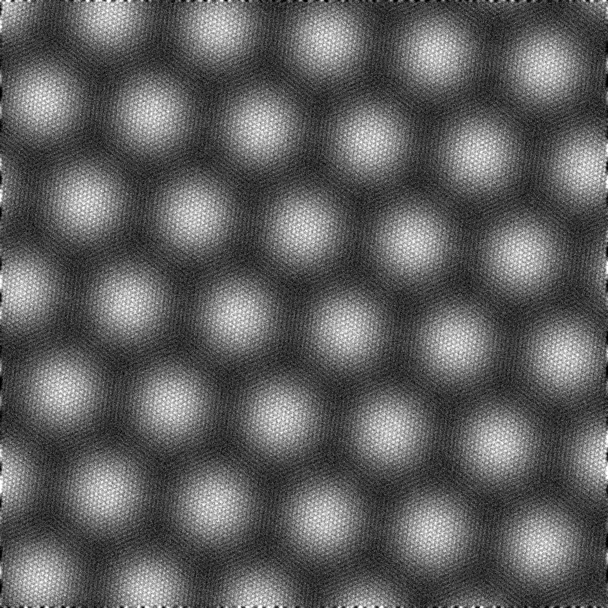

# Moire Twist Ruler

Measure the moire domain length and twist angle of twisted 2D bilayers by drawing
one line per image. A single HTML page: no install, no server, and your images
never leave your computer.

## Use it

- **Online:** https://will700.github.io/moire-twist-ruler/ (demo with examples: https://will700.github.io/moire-twist-ruler/#examples), or
- **Offline:** download `index.html` and open it in any modern browser.

1. **Open images** (or drag them onto the page). PNG, JPEG and WebP work directly;
   convert microscope files first (below).
2. Set the **pixel size** (nm per pixel) once per image or with *Apply to all*, or drop a
   `scales.csv` (`filename,nm_per_px`) together with the images.
3. Pick the material's **lattice constant** (WS2, MoS2, WSe2, MoSe2, graphene, hBN or custom).
4. **Drag a line** from one domain node (AA site or domain-wall crossing) to another a few
   domains away along a row, and set **periods** to the number of domains it spans. A circle
   marks each period, so you can see at once whether they sit on the nodes.
5. Tick **Don't use this one** for images that should not count (folds, contamination,
   unclear networks).
6. **Download CSV**: one row per image with line length, periods, domain length L,
   twist, and whether to use it. *Save session* keeps your lines in a file to reload later.

Keyboard: left and right arrows change image, `+` and `-` change the period count.

## The maths

L is the AA-to-AA moire period, the line length divided by the number of periods. For
a homobilayer with lattice constant *a* the twist is

    theta = 2 asin(a / 2L)

so L = 18 nm is about 1.0 deg for WS2. Heterobilayers (lattice mismatch) and
heterostrain are not modelled; with strain the three moire directions differ, so draw
along the direction you want to report, or measure a few images and compare.

Measuring across several periods is more precise than one: the error in L shrinks as
1/n.

## Try it on the examples

`examples/` holds three synthetic rigid twisted-bilayer images (WS2 lattice, 1.0, 2.5
and 4.0 deg) made by `tools/make_examples.py`, with their pixel sizes and true twists
in `examples/scales.csv`. *Load examples* opens them when the page is served (GitHub
Pages, or `python -m http.server` in this folder); the page then shows the true twist
next to yours so you can check your technique.

## Converting microscope files

    pip install rosettasciio numpy pillow scipy
    python tools/prepare_images.py converted/ your_images/*.dm4

This writes one PNG per image (lightly detrended and contrast-stretched) and a
`scales.csv` with the pixel size read from each file's calibration. Open the PNGs and
the CSV together in the page.

## Background

Low-angle twisted bilayers of transition metal dichalcogenides relax into domains of
commensurate stacking separated by domain walls, and the domain period grows as the
twist falls. See Weston et al., "Atomic reconstruction in twisted bilayers of
transition metal dichalcogenides", Nature Nanotechnology 15, 592 (2020),
https://doi.org/10.1038/s41565-020-0682-9 (preprint: https://arxiv.org/abs/1911.12664).
The example images here are synthetic and rigid (no relaxation); no published or
unpublished experimental data is included in this repository.

## Privacy

Everything runs in your browser. Images are read locally and are not uploaded or
stored; only your lines, pixel sizes and settings are kept in the browser's local
storage (per image name) so you can close the tab and continue later. Clear them with
your browser's site-data settings.

## Licence

MIT
