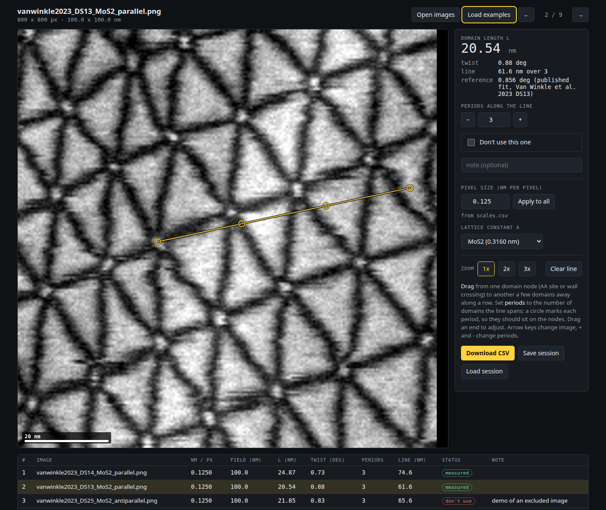

# Moire Twist Ruler

A small browser tool for measuring the moire period and twist angle of twisted 2D
bilayers. You draw lines across a few domains on each image (one, or as many as the
image has rows of domains), and it gives you the domain length and the twist. Everything runs locally in your browser; images are not
uploaded anywhere.

**Open it:** https://will700.github.io/moire-twist-ruler/ (or try it with example data:
https://will700.github.io/moire-twist-ruler/#examples)

Draw a line from node to node, say how many domains it spans, and you get the domain
length L and the twist. Draw as many lines as you like on one image: each is its own
domain-length measurement, and the image gets their mean, spread and count. The example
readings below, one line per image:

| image | use | line (nm) | periods | L (nm) | twist (deg) | note |
|---|---|---|---|---|---|---|
| DS14_MoS2_parallel | yes | 74.6 | 3 | 24.87 | 0.73 |  |
| DS13_MoS2_parallel | yes | 61.6 | 3 | 20.54 | 0.88 |  |
| DS25_MoS2_antiparallel | no | 65.6 | 3 | 21.85 | 0.83 | demo of an excluded image |
| DS7_MoS2_parallel | yes | 30.1 | 2 | 15.04 | 1.20 |  |
| DS22_MoS2_antiparallel | yes | 21.8 | 2 | 10.88 | 1.66 |  |
| DS5_MoS2_parallel | yes | 38.8 | 4 | 9.70 | 1.87 |  |

(From the example images: [full CSV](docs/img/example_output.csv). The published twists for
these samples are 0.82, 0.86, 0.77, 1.23, 1.69 and 1.77 deg; single-direction readings
spread a little because the samples carry some heterostrain.)

All example data in this repository is public: six images come from an openly licensed
published dataset (CC BY 4.0, credited below) and three are synthetic, generated by a
script in `tools/`. No private or unpublished data is included. See
[examples/README.md](examples/README.md) for where each image comes from.

## How to use it

1. Open your images (PNG, JPEG or WebP), or drag them onto the page.
2. Enter the pixel size in nm per pixel. "Apply to all" sets it for every image.
3. Pick your material, which sets the lattice constant.
4. Drag a line from one domain node to another a few domains along, then set how many
   periods the line covers. Circles mark each period so you can check they land on the
   nodes.
   Drag again to add more lines on the same image (other rows, other directions); click a
   line to select it, Shift-drag always starts a new one, Delete removes the selected one.
   Every line is a separate domain length (new lines start at 1 period); the image's L is
   their mean, with the standard deviation and range.
5. Tick "Don't use this one" for any image you want to leave out.
6. Download the CSV when you're done: one row per line (with its direction), plus the
   mean, standard deviation and range for its image.

To load a whole set at once, serve a folder with a `manifest.json` (a list of
`{"file": "...", "nm_per_px": ...}`) and open `index.html?manifest=manifest.json`. Add
`&save=<url>` to have the page POST the whole session to your own local server after
every change (and restore from a GET on the same url), so the lines are kept on disk too.

Arrow keys move between images, and + / - change the number of periods. Your lines are
remembered in the browser, so you can close the tab and come back.

Microscope files (dm3, dm4, emd, tif) need converting to PNG first:
`python tools/prepare_images.py out_folder/ your_files/*.dm4` also writes a
`scales.csv` with the pixel sizes, which you can open together with the images.

## More

The maths, the example data and conversion details are in [docs/details.md](docs/details.md).

The experimental example images come from Van Winkle et al., Nature Communications 14,
2989 (2023), data at https://doi.org/10.5281/zenodo.7779105 (CC BY 4.0).

Code is MIT licensed.
