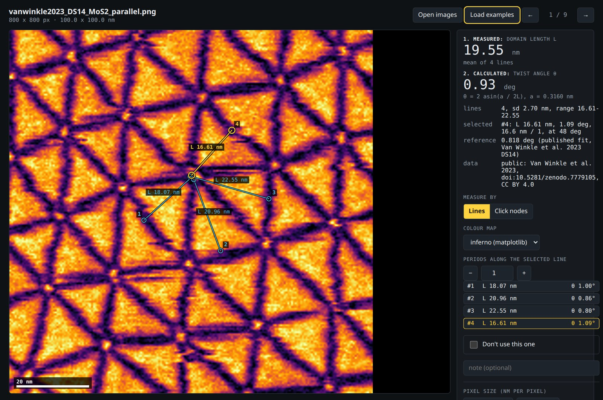
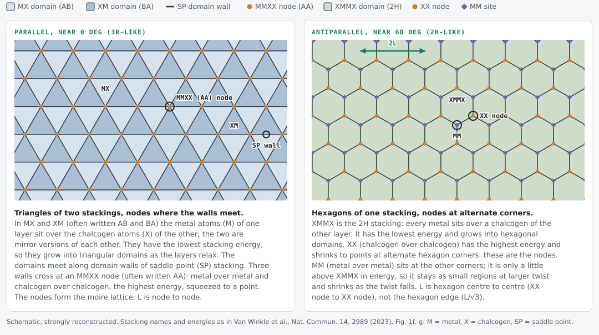
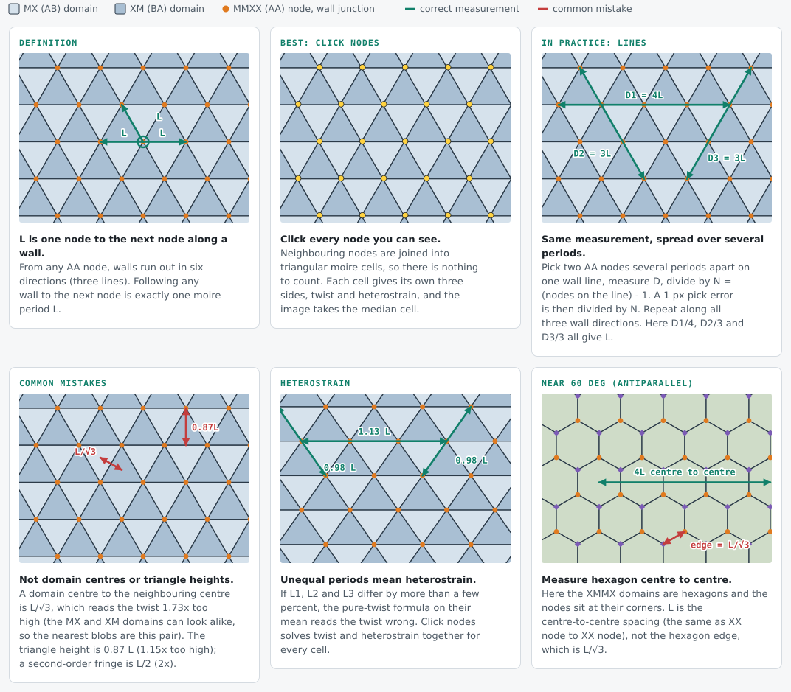

# Moire Twist Ruler

A small browser tool for measuring the moire period and twist angle of twisted 2D
bilayers. You measure the domain length, by clicking every domain node or by drawing lines
from node to node, and it calculates the twist angle from it. Everything runs locally in
your browser; images are not uploaded anywhere.

**Open it:** https://will700.github.io/moire-twist-ruler/ (or try it with example data:
https://will700.github.io/moire-twist-ruler/#examples)

**Two ways to measure, one answer.** The panel always shows what is measured (1. the
domain length L) and what is calculated from it (2. the twist angle).

- **Click nodes** (above). Click every domain node you can see. The nodes are joined into
  triangular moire cells, each cell is solved for its own twist and heterostrain and
  coloured by its local twist, and the image gets the median cell. There is nothing to
  count, and a twist that drifts across the field shows up as a colour gradient.
- **Lines** (below). Drag from node to node; each line is its own domain length, labelled
  on the image, with its twist in the list beside it. The image gets the mean, spread and
  count of its lines.

The same image (Van Winkle et al. 2023 dataset DS14, published twist 0.818 deg) read both
ways:

| mode | what was measured | domain L (nm) | twist (deg) |
|---|---|---|---|
| Click nodes | 26 nodes, 33 cells | 22.24 (sides 19.46, 22.14, 25.13) | 0.83 +- 0.01 (cell median; 0.77-0.91 across the field) |
| Lines | 4 single-period lines from one node | 19.55 (sd 2.70) | 0.93 |
| published | Bragg interferometry fit | | 0.818 |

The three periods differ by about 25 %: this sample carries heterostrain, so lines in
different directions disagree, and the node cells, which solve twist and strain together,
land closer to the published value. Exported results for this image:
[lines](docs/img/example_output.csv), [nodes](docs/img/example_nodes.csv) and
[cells](docs/img/example_cells.csv).

All example data in this repository is public: six images come from an openly licensed
published dataset (CC BY 4.0, credited below) and three are synthetic, generated by a
script in `tools/`. No private or unpublished data is included. See
[examples/README.md](examples/README.md) for where each image comes from.

## What you are looking at

A small twist does not leave the two layers rigid. They relax towards the low-energy
stackings, so the moire pattern becomes a network of domains separated by thin walls. The
names below are the ones Van Winkle et al. 2023 use for twisted MoS2 (M = metal,
X = chalcogen, each name says which atoms sit on top of each other):

- **Parallel, near 0 deg (3R-like).** MX and XM (often written AB and BA) are the two
  low-energy stackings, mirror versions of each other, and they grow into **triangular
  domains**. They meet along **domain walls** of saddle-point (SP) stacking. Three walls
  cross at an **MMXX node** (often written AA): metal over metal and chalcogen over
  chalcogen, the highest energy, squeezed to a point.
- **Antiparallel, near 60 deg (2H-like).** XMMX, the 2H stacking, is the low-energy one and
  grows into **hexagonal domains**. XX (chalcogen over chalcogen, highest energy) shrinks to
  points at alternate hexagon corners: these are the **nodes**. MM (metal over metal) sits at
  the other corners; it is only a little above XMMX in energy, so it stays as small regions
  at larger twist and shrinks as the twist falls.

The nodes do not move when the layers relax, so in both cases they mark the moire lattice,
and the period L is measured between them.

## How to measure a domain

The moire period L is the distance from one **MMXX (AA) node** (where three domain walls
meet) to the next node along a wall (Definition). That is the quantity in the twist
formula, and it is the right one for three reasons:

- **The nodes are the moire lattice.** At a node the two layers sit atom on atom, so going
  from one node to the next is exactly one period. Domain centres and wall midpoints are
  features inside a cell, not lattice points.
- **Reconstruction does not move the nodes.** Relaxation grows the triangles and sharpens
  the walls, but the node lattice keeps the period a / (2 sin(theta/2)).
- **Nodes are sharp.** Three walls meet at a point, so a node can be placed to a pixel or
  two; domain centres are broad and flat.

The two ways to measure in the ruler:

- **Click nodes (best).** Click every node you can see. Neighbouring nodes are joined into
  triangular moire cells, so there is nothing to count, and each cell gives its own three
  sides, twist and heterostrain. Real networks are rarely uniform (heterostrain stretches
  the cells, and the twist drifts across the field), so the cells are measured one by one
  rather than forced onto a single lattice.
- **Lines (in practice).** Drag from a node to another node several periods along one
  wall, and set the periods to *nodes on the line minus one*. Do this along all three wall
  directions. Counting triangles instead of nodes gives about two per period and doubles
  theta.

Common mistakes: domain centre to the neighbouring centre is L / sqrt(3), which reads theta
1.73x too high (the MX and XM domains can look alike, so the nearest bright blobs are this
pair); the triangle height is 0.87 L (theta 1.15x too high); a second-order fringe is L / 2
(theta 2x too high).

If the three periods differ by more than a few percent the bilayer carries heterostrain.
Then the pure-twist formula on the mean period reads the twist wrong (a synthetic WS2 cell
at 1.00 deg with 0.5 % strain has sides 15.3, 20.2 and 20.6 nm, and the formula on their
mean gives 0.97 deg); Click nodes mode solves twist and heterostrain together. Near 60 deg
(antiparallel) the XMMX domains are hexagons with the nodes at their corners: L is the
hexagon centre-to-centre spacing, not the hexagon edge (L / sqrt(3)).

The diagrams are drawn by `tools/make_measure_diagram.py`.

## How to use it

1. Open your images (PNG, JPEG or WebP), or drag them onto the page.
2. Enter the pixel size in nm per pixel. "Apply to all" sets it for every image.
3. Pick your material, which sets the lattice constant.
4. Drag a line from one domain node to another a few domains along, then set how many
   periods the line covers. Circles mark each period so you can check they land on the
   nodes.
   Drag again to add more lines on the same image (other rows, other directions); click a
   line to select it, Shift-drag always starts a new one, Delete removes the selected one.
   Every line is a separate domain length (new lines start at 1 period); the image's L is
   their mean, with the standard deviation and range.
   Or switch **Measure by** to **Click nodes** and click every domain node instead. The
   nodes are joined into triangular cells, drawn over the image and coloured by their local
   twist. Each cell's sides L1, L2, L3 are solved for twist and uniaxial heterostrain; the
   image gets the median cell (twist with its error, heterostrain, the 10-90 % range of local
   twist, and the pure-twist value for comparison). Slivers at the edge and triangles across
   a missing node are left out (dashed). Click a node again to remove it, drag to move it.
   Lines and nodes are kept separately on each image.
5. **Colour map** switches the display between grey and inferno (display only: the image
   and the measurements are unchanged), so the page can match inferno-rendered exports.
6. Tick "Don't use this one" for any image you want to leave out.
7. Download the CSV when you're done: one row per line (with its direction), plus the
   mean, standard deviation and range for its image. **Node CSV** gives two files:
   `moire_nodes.csv` (one row per clicked node with its image result) and `moire_cells.csv`
   (one row per cell: its nodes, sides, angles, twist and heterostrain).

To load a whole set at once, serve a folder with a `manifest.json` (a list of
`{"file": "...", "nm_per_px": ...}`) and open `index.html?manifest=manifest.json`. Add
`&save=<url>` to have the page POST the whole session to your own local server after
every change (and restore from a GET on the same url), so the lines and nodes are kept on disk too.
`&export=<url>` adds an **Export** button that saves first, then POSTs to that url and
shows the steps your server reports back (for example writing the results into your own
spreadsheet).

Arrow keys move between images, and + / - change the number of periods. Your lines and
nodes are remembered in the browser, so you can close the tab and come back.

Microscope files (dm3, dm4, emd, tif) need converting to PNG first:
`python tools/prepare_images.py out_folder/ your_files/*.dm4` also writes a
`scales.csv` with the pixel sizes, which you can open together with the images.

## More

The maths, the example data and conversion details are in [docs/details.md](docs/details.md).

The experimental example images come from Van Winkle et al., Nature Communications 14,
2989 (2023), data at https://doi.org/10.5281/zenodo.7779105 (CC BY 4.0).

Code is MIT licensed.
