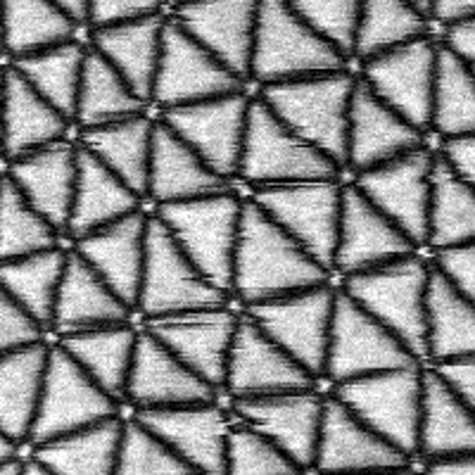

# Moire Twist Ruler

A small browser tool for measuring the moire period and twist angle of twisted 2D
bilayers. You draw one line across a few domains on each image, and it gives you the
domain length and the twist. Everything runs locally in your browser; images are not
uploaded anywhere.

**Open it:** https://will700.github.io/moire-twist-ruler/ (or try it with example data:
https://will700.github.io/moire-twist-ruler/#examples)

## How to use it

1. Open your images (PNG, JPEG or WebP), or drag them onto the page.
2. Enter the pixel size in nm per pixel. "Apply to all" sets it for every image.
3. Pick your material, which sets the lattice constant.
4. Drag a line from one domain node to another a few domains along, then set how many
   periods the line covers. Circles mark each period so you can check they land on the
   nodes.
5. Tick "Don't use this one" for any image you want to leave out.
6. Download the CSV when you're done.

Arrow keys move between images, and + / - change the number of periods. Your lines are
remembered in the browser, so you can close the tab and come back.

Microscope files (dm3, dm4, emd, tif) need converting to PNG first:
`python tools/prepare_images.py out_folder/ your_files/*.dm4` also writes a
`scales.csv` with the pixel sizes, which you can open together with the images.

## More

The maths, the example data and conversion details are in [docs/details.md](docs/details.md).

The experimental example images come from Van Winkle et al., Nature Communications 14,
2989 (2023), data at https://doi.org/10.5281/zenodo.7779105 (CC BY 4.0).

Code is MIT licensed.
